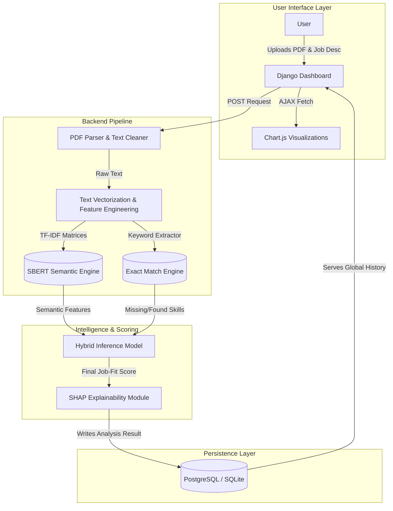

# InsightX: AI-Powered Resume Scoring & Explainability Platform

InsightX is an intelligent, end-to-end application designed to evaluate candidate resumes against specialized job descriptions. By fusing traditional Natural Language Processing (TF-IDF vectorization) with state-of-the-art semantic models (SBERT Cosine Similarity) and SHAP (Shapley Additive Explanations), InsightX provides highly accurate job-fit scoring while ensuring absolute transparency in how the AI makes its decisions.

## Architecture & Data Flow

InsightX is built on a robust Django multi-page architecture, serving an asynchronous frontend powered by Bootstrap and Chart.js.



## Key Technologies

- **Backend:** Django, SQLite/PostgreSQL, Python 3.11+
- **Machine Learning Engine:** Scikit-Learn (TF-IDF, Logistic Regression Classifier), Sentence-Transformers (SBERT Semantic Similarity)
- **Explainable AI (XAI):** SHAP (TreeExplainer/LinearExplainer) to extract pixel-perfect positive and negative term contributions.
- **Frontend:** HTML5, Vanilla JavaScript, Bootstrap 5 (Responsive Modals & Dashboards), and Chart.js for interactive scoring radials.

## Core Features
1. **Hybrid Semantic Analysis:** Overcomes traditional keyword bias by executing SBERT-driven semantic cosine similarity. If the resume says "Python Developer" and the job asks for "Software Engineer", the system organically bridges the semantic gap.
2. **Transparent Diagnostics (XAI):** A massive criticism of AI hiring tools is the "Black Box". InsightX actively generates SHAP contribution values to show exactly *why* a candidate was docked points (e.g., heavily penalized for missing "Kubernetes").
3. **Visual Dashboard:** An aesthetic, modern UI offering tier-based categorizations (Perfect Match, Good Match, Requires Review) alongside dynamic progress bars mapping directly to found and missing skill sets.
4. **Administration Ready:** Fully integrated Django routing allowing super-users to trace, clear, and audit the global resume history seamlessly.

## Getting Started

### 1. Environment Setup
```bash
# Clone the repository
git clone https://github.com/your-username/InsightX.git
cd insightx

# Activate your environment
conda activate dev

# Install requirements
pip install -r requirements.txt
```

### 2. Database Initialization
```bash
# Apply Django schemas
python manage.py makemigrations
python manage.py migrate
```

### 3. Launching the App
```bash
# Start the Web Server
python manage.py runserver 0.0.0.0:8000
```
Navigate to `http://localhost:8000` to upload your first resume!
